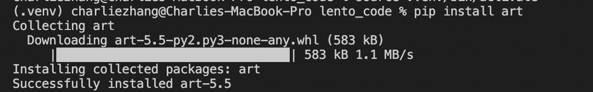

# Packages and Modules

In code, **packages** are a collection of various files written by other people that have helpful functions you can use with in your projects. Each of these files are called **modules**. Packages and modules are made by other people and you add them to your code by typing their name. This is known as *importing a module*.

Let’s use our number guessing game from last week as an example. Looking at our code, we could improve it by adding a feature that makes `correct_number` completely random each time you play the game. We can do this with a module. Let’s use the module `random.` This is a module that generates random numbers. By typing `import` and then the module name, I am now able to access the various functions in the module and use them in my code:

```py
import random
```

The `random` module has a function called `randint()` that we can use to generate a random integer for us. Now, the parameters that the `randint()` function accepts are a range to use for generating the random number: the first number represents the lower range and the second number represents the upper range. For example, if I put `random.randint(1, 100)`, it will generate a number between 1 and 100.

```py
import random
correct_number = random.randint(1, 100)
# As you can see, we're using the
# random.randint(lower_num, higher_num) structure above.
print(correct_number)
```


Now, if we play through the game again, you will see that the numbers generated are completely random.


A good way to find out what you can do with a module is searching up the name of the module online and finding information on [StackOverflow](https://stackoveflow.com) or directly from the module's documentation. Here are some useful functions from the `random` module's documentation that you can play around with:

```py
>>> random()  # Generates random float (decimal number)
0.37444887175646646

>>> uniform(2.5, 10.0)  # Generates random float between a lower_number and an upper_number
3.1800146073117523

>>> randrange(10)  # Generates integer from 0 to 9 inclusive
7

>>> choice(['win', 'lose', 'draw'])  # Returns a random element from a list
'draw'
```

So far, you've imported the `random` module into your code and started using it. But you might be asking, “where did this module come from?”. Well, the `random` module is from the Python Standard Library, also known as `stdlib`, which is a set of modules that come with Python and that can be used without installing anything else on your computer. If you want to use a third-party module not officially sponsored by Python, though, you have to install its package first manually.

## Virtual Environments
Before we install a third-party package, though, we need to make a **virtual environment**, also known as a `venv`.

### What is a `venv`?
In Python, virtual environments are spaces where various Python-related programs can be installed, without modifying your main Python installation. The programs are instead stored in a different folder, and you can tell Python to use this virtual environment folder instead of your system-wide environment using special commands.

### Why are `venv`s important?
When you're working on Python projects, you may install various programs, such as a few third-party packages or separate, specific versions of Python. If you install these programs using your on Therefore, if you install all your programs in your terminal into your main, system-wide Python environment, programs may start to interfere with each other. It also becomes difficult to keep track of what programs are relevant to a specific project. Therefore, for each Python project you work on, you should create a virtual environment to install the necessary packages and programs in.

### So, how do I make a `venv`?

1) Make a folder with your guessing game file (`guessing_game.py`).
2) Next, inside that folder, type:

```bash
python3 -m venv .venv
```

Great! You've just made a `venv`, stored in a folder named `.venv`.

3) Activate your `venv` by typing:

```bash
source .venv/bin/activate
```

Now, you're all set to install packages and programs for your project. If you wanted to turn off your `venv`, simply type:

```bash
deactivate
```

However, don't deactivate your `venv` just yet; you'll be installing a package to help spruce up your guessing game project.

## Installing Packages
Now that you have a `venv` up and running, let’s install the third-party `art` package to display a few graphics in the terminal for our guessing game. In most languages, there is usually a **package manager** to help you install and manage packages for that language. Python's official package manager is known as `pip`. So, to install the `art` package with `pip`, type the following into your terminal:

```bash
python3 -m pip install art
```

Your terminal should look something like the below



Once that’s done, you can access specific modules in art by adding the following to the top of your Python file:

```py
from art import art, tprint
```

Here, I’m referring to the `art` package (`from art`) and importing the `art` and `tprint` modules from it (`import art, tprint`). After we've done this, we can now access the `tprint` and `art` modules in the art package and use them in our code.

One function that is pretty useful is the `tprint()` function. Using `tprint()`, you can display text in your terminal and choose what font you want your text to be printed as. `tprint()` accepts two parameters: a string of text to print fancily, and a font name:

```py
tprint("Welcome to my game!", font="bulbhead")
```

If you add this above the `while` loop in your guessing game code and then run the Python file again, you will see your message:


Another useful function is the `art()` function, which prints out an emoticon in your terminal. This function also accepts 2 parameters: an emoji name as a string, as well as a number for how many to display. For example, here is a single coffee emoji:

```py
emoticons = art("coffee")
print(emoticons)
```


If I wanted to have 2 coffee emojis next to each other, I can also put in 2 as a second parameter in the art() function.

```py
emoticons = art("coffee", 2)
print(emoticons)
```


> 📖 You can read more about the `art` module [here](https://github.com/sepandhaghighi/art/blob/master/README.md#usage).

And that's how you use packages, modules, and their functions in Python. Up next, a project!
