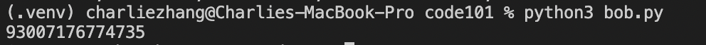
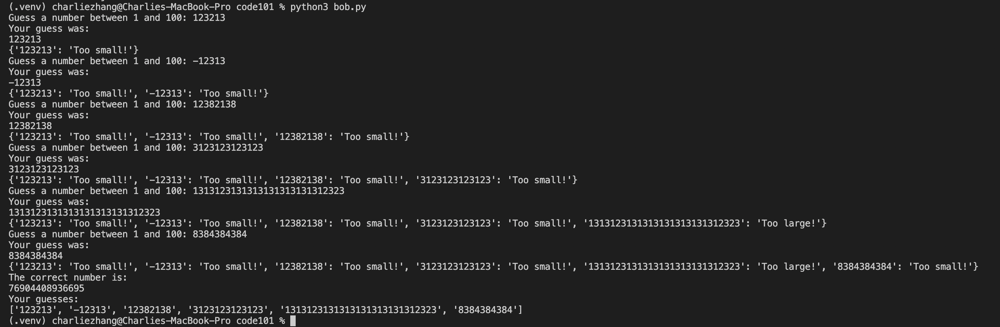
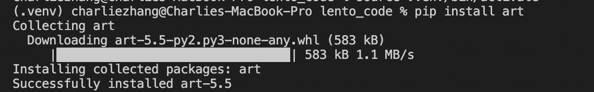
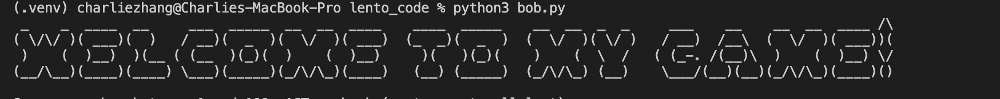
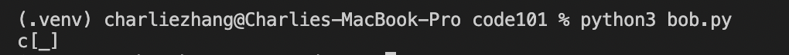
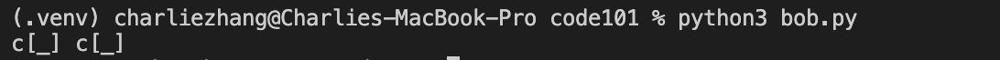

# Packages and Modules

In coding, packages are a collection of various files that have functions to do useful things with. Each of these files are called modules. They are made by other people and you put them in your code by typing its name. Let’s use our number game from last week as an example. Looking at our code, an improvement that can be made is to make the ```
correct_number ``` completely random. We can do 
this with a module. Let’s use the module 
```random.``` This is a module that generates random numbers. By typing ```import``` and the module name, I am now able to access all the various functions in the module and put them in my code. 

```py
import random
```

In the module ```random```, we can call the function ```randint()``` to generate a random integer for us. Now, the parameters that the ```randint()``` function accepts is a range to generate a number from – a number here to specify the lower range and a number here to specify the upper range. For example, if I put ```random.randint(1000, 1203918)```, it will generate a number between 1000 and 1203918. 

```py
import random
correct_number = random.randint(1000, 1203918)
#randint(lower_num, higher_num)
print(correct_number)
```


Now, if we play through the game again, you will see that the numbers generated are completely random.




If you want to know more about what functions the random module has, you can find it by searching up “random module python.” Here are some useful functions that you can play around with:
```py 
>>> random() # Generates random float (decimal number)
0.37444887175646646

>>> uniform(2.5, 10.0)  #Generates random float between uniform(lower_number, upper_number)
3.1800146073117523

>>> randrange(10)  #Generates integer from 0 to 9 inclusive
7

>>> choice(['win', 'lose', 'draw']) # Returns single random element from a sequence
'draw'
```

So far, you have imported the random module in your code and started using it. But you might be asking, “where did this module come from?” Well, the random module is from the Python Standard Library, which is a library of modules that came with python when it was installed your computer, and can be used anytime. If you want to use a module that was made off the internet, though, you have to install its package first. 

# Virtual Environments
Before we install a package, though, we need to make a virtual environment (venv). 

> What is a venv?

In code, virtual environments are spaces where various programs can be installed. 

> Why is this important?

When you're working on code projects, you may install various program, such as a package or two. Therefore, if you install all your programs on your computer-wide terminal and keep them all in one enviornment, programs will start to interfere with each other. Therefore, for each code project you work on, you must create a virtual envioronment to run the programs that you need for it.

> How do I make one?

First, you should make a folder with your guessing_game.py. Next, in the folder, type:

```py
python3 -m venv .venv
```
Great! You've just made a venv with the file name ```.venv```

Next, activate your venv by typing:

```py
source .venv/bin/activate 
```
Now you're all set to install packages and programs for your projects. To turn off your venv, simply type:

```py
deactivate
```
For the rest of this project, though, don't deactivate your venv just yet. 

Now that you have a venv, let’s install the ```art``` package to display a few graphics on our game. In every language, there is usually a package installer to help install and manage your packages with that language. In Python, the package installer is called pip. So, to install the art package with pip, type in pip install art in your terminal.

```py
pip install art
```


Once that’s done, you can access the modules in art by typing from art. 
```py
from art
```
Next, type import art, tprint. 
```py
from art import art, tprint
```
Here, I’m referring to the art package and importing the art and tprint modules from it. Now, we can access the functions of the tprint and art modules in the art package and use them in our code.

One function that is pretty useful is the tprint() function. tprint accepts two parameters, text as a string, and font. Here, you can display text in your terminal and choose what font you want your text as. If we run the code again, you will see your message.

```py
from art import art, tprint
tprint("Welcome to my game!", font = bulbhead)
```



Another useful function is the art() function. It will print an emoji in your terminal. The parameters this function accepts is an emoji name as a string.
For example, here is a coffee emoji:
```py
from art import art, tprint
joe = art("coffee")
print(joe)
```

If I wanted to have 2 coffee emojis next to each other, I can also put in 2 as a second parameter in the art() function.
```py
from art import art, tprint
joe = art("coffee", 2)
print(joe)
```

And that's how you use Packages, Modules and their functions in Python. Up next, a project!