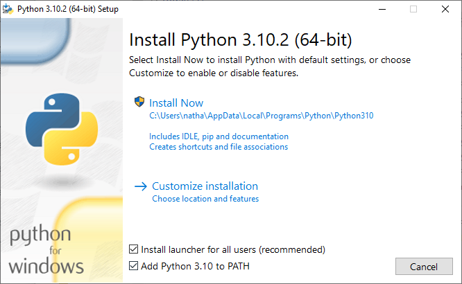

# Installing all The Things

Here, we'll walk through a quick summary of the IDE we're going to use in this book, as well as getting Python installed and ready on your computer.

> ⚠️  Some of the tools we'll be using may require administrator permissions. They're all safe to install (we use them ourselves, and they're extremely popular tools in the developer community) but it's always good to double-check what you're giving administrator powers to.

## VSCode
Visual Studio Code (VSCode for short) is the most popular IDE in the world, according to the [2021 Stack Overflow Developer Survey](https://insights.stackoverflow.com/survey/2021#section-most-popular-technologies-integrated-development-environment). We'll be using it in this book, as it is free, light on resources, and useful to beginners and veterans alike.

**You can install VSCode from [here](https://code.visualstudio.com)  (if you're on a Chromebook, skip to the [special instructions](./installing-all-the-things.md#chrome-os) below)**. When you open it up, it should look something like this:

VSCode is pretty intuitive (you can always search up "how to do X in VSCode") but here are some quick tips to get you started:
- you can open folders or files using `File > Open` or `File > Open Folder...`
- Opened files/folders show in the Explorer (first icon in the left sidebar, looks like two pieces of paper)
- `Ctrl-Shift-P` (`Cmd-Shift-P` on macOS) brings up the **Command Palette**, which allows you to quickly search and use VSCode's various features
- `Ctrl-P` (`Cmd-P` on macOS) brings up the **Go To File** menu, which allows you to quickly search and switch to your open files
- `Ctrl-J` (`Cmd-J` on macOS) brings up the **Terminal** window. We'll cover what this does in a minute.

For now, you don't need to do anything with VSCode, unless you want to play with it a bit. We'll be using it more in the next section.

## Installing Python
You'll also need to install Python so that you can actually run Python code on your computer! **You can find the latest version of Python [here](https://www.python.org/downloads/release/python-3102/) (find your OS at the bottom of the page)**. When you open up the installer, it should prompt you with some instructions and ask you to accept a license agreement before installing. There are also some OS-specific instructions for installing Python below.

> ⚠️  If you've already installed Python, make sure it is up-to-date so you can follow along with this guide. 3.10 or newer is preferred, although any version of Python newer than 3.8 should be fine. Check the OS-specific instructions as well so that you can make sure your Python install works as expected.

### Windows
On Windows, the Python installer should show a window like this:

It's important that you check the boxes exactly as shown in the pictures above as that will allow you to follow along with the book with no issues.

### macOS
macOS actually comes with a version of Python; however, it's missing a few features and is usually not up to date, so we recommend installing it manually anyway.

### Chrome OS
We don't have a Chromebook to test out Python and VSCode installs. However, the reputable Codecademy has put out some instructions on [enabling Linux support](https://www.codecademy.com/article/programming-locally-on-chromebook) (required for installing these kinds of tools) and [installing Python and VSCode](https://www.codecademy.com/article/programming-python-on-chromebook) which should work fine.

> 💬 If you've installed Python successfully through a quicker/easier method on your Chromebook, or the above instructions don't work, feel free to contact us[^1]!

## Safety Check
To check whether all of your installs work as expected, open up VSCode and use `Ctrl-j`/`Cmd-j` to open it up in VSCode:

Type `python3` and then hit enter on your keyboard. You should get something like this:

If your screen looks like the above, congratulations! You've got everything working as required.

[^1]: see the [Foreword](../foreword.md#about-the-authors) for details
